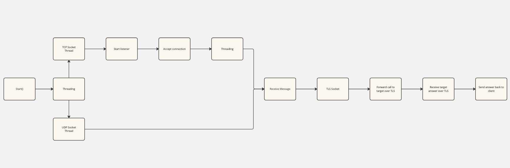

# 53Prox: DNS Proxy over TLS

53Prox is a simple DNS proxy server written in Python. It intercepts DNS queries on the standard DNS port (53) and securely forwards them to an upstream DNS server over TLS, enhancing privacy and security by encrypting DNS traffic.

## Features

- **DNS to DNS over TLS Translation**: Converts DNS queries into DNS over TLS queries.
- **Configurable Upstream Servers**: Allows specification of any DNS over TLS servers, such as 1.1.1.1 (Cloudflare), 8.8.8.8 (Google), or any other provider that supports DNS over TLS.
- **UDP and TCP Support**: Whether a client sends a DNS request over TCP or UDP, it is forwarded to the DNS server over TLS.

## Application Design/Architecture

53Prox is intended to support both UDP and TCP while handling multiple connections at the same time. It starts by creating 2 threads for handling each protocol idependently and then starting each socket on their respective threads.

A third socket is created to handle the TLS communication between the proxy and the upstream DNS server. After a message is received, it is passed to the TLS socket and then sent to the target.

The following image ilustrates the mentioned steps:



## Getting Started

Steps to get the application up and running.

### Prerequisites

- Python
- Docker (Optional)

### Installation

Clone the repository:

```bash
git clone https://github.com/Lincon-Freitas/53Prox.git
cd 53Prox
```

### Configuration

Edit the `config.json` file to specify the upstream DNS over TLS provider:

```json
{
  "target": "1.1.1.1"
}
```

You can also edit the log settings:

```json
{
    "logging": {
        "level": "INFO",
        "format": "%(asctime)s %(levelname)s %(message)s",
        "datefmt": "%Y-%m-%d %H:%M:%S"
    }
}
```

### Running the Proxy script directly

To start the DNS proxy, run:

```bash
python3 server.py
```

The proxy will listen both UDP and TCP requests on port 53 for incoming DNS queries and will forward them securely over TLS.

### Running the Proxy with Docker

To run the proxy on a Docker container, first build the image using the already created Dockerfile:

```bash
docker build -t 53prox .
```

After that we can run the container:

```bash
docker run --name 53prox 53prox
```

You can verify the container is running with the following command:

```bash
docker container ls
```

## Usage Example

To test the DNS proxy, you can use `dig`:

For UDP:

```bash
dig @<ip> google.com
```

For TCP:

```bash
dig @<ip> google.com +tcp
```

The `<ip>` will vary depending on the machine it runs. It can be different from your machine's IP when running on a docker container.

You can check the proxy logs to ensure you have the correct IP:

```bash
2024-04-28 13:44:13 INFO [STARTING] Server is starting...
2024-04-28 13:44:13 INFO [LISTENING] Server is listening on 172.17.0.3 udp/53
2024-04-28 13:44:13 INFO [LISTENING] Server is listening on 172.17.0.3 tcp/53
```

You can also use the script `generate_requests.sh` to generate the requests:

```bash
chmod +x generate_requests.sh
./generate_requests.sh
```

This will generate requests to both TCP and UDP. Change the values as desired for testing purposes.

This will resolve `google.com` using your DNS proxy.
